<div align="center">



<br/>
<a href="#about"></a>
<a href="#journey"></a>
<a href="#stack"></a>
<a href="#dashboard"></a>
<a href="#connect"></a>


<br/>

<table>
<tr>
<td align="center"></td>
<td align="center"></td>
</tr>
</table>


</div>

<br/>

##  `about` <a name="about"></a>

<table>
<tr>
<td width="60%" valign="top">

```python
class ThiruXD:
    def __init__(self):
        self.name = "ThiruXD"
        self.age = 19
        self.location = "Tamil Nadu, India 🇮🇳"

        self.education = (
            "B.Tech in Computer Science (Lateral Entry) at GCU [2025 - present]",
            "Diploma in Electronics & Communication Engineering (ECE) at PSV College [2022 - 2024]"
        )

        self.core_skills = [
            "Backend Development",
            "Frontend Development (intermediate)",
            "WordPress Development",
            "AI-assisted Development",
        ]


    def currently_learning(self):
        return [
            "System Design",
            "Data Structures & Algorithms",
            "DevOps & Cloud",
            "AI-assisted Development"
        ]

    def journey(self):
        return {
            2020: (
                "Started exploring Telegram bots during the COVID-19 lockdown."
            ),

            2021: (
                "Learned the basics of Python and deployed my first Telegram bot "
                "on Heroku's free tier using open-source projects. "
                "Built my first bot, Wolf X Robot, featuring group management "
                "and voice chat music playback."
            ),

            2022: (
                "Improved my Python and MongoDB skills through YouTube and "
                "W3Schools. Added custom fun and utility modules to Wolf X Robot "
                "while pursuing my first year of ECE diploma."
            ),

            2023: (
                "Wolf X Robot unexpectedly grew to 140K+ users across 2,000+ "
                "Telegram groups. Started deploying more bots, freelancing for "
                "Telegram clients, and experimenting with AI-assisted development "
                "using ChatGPT and Google Bard during my second year of diploma."
            ),

            2024: (
                "Shifted my focus toward Software Engineering and Computer Science. "
                "Started learning backend architecture, APIs, MongoDB, Flask, "
                "FastAPI, and web fundamentals (HTML, CSS, JavaScript), while "
                "also exploring WordPress development."
            ),

            2025: (
                "Dived deeper into Open Source and FOSS. Learned React, Tailwind CSS, "
                "and started building full-stack applications with AI. "
                "Joined B.Tech in Computer Science through lateral entry after "
                "completing my diploma."
            ),

            2026: (
                "Building modern full-stack products, contributing to open source, "
                "and continuously learning scalable backend architecture, cloud "
                "technologies, and system design."
            ),
        }
```

</td>
<td width="40%" valign="top">

**📍 Quick Facts**

| | |
|---|---|
| 🎂 Age | 19 |
| 🌆 Location | Tamil Nadu, India |
| 🎓 Now | B.Tech CS @ GCU |
| 🎓 Before | Diploma ECE @ PSV College |
| 💼 Focus | Backend + AI-assisted Dev |

**🌱 Currently Learning**

```
▰▰▰▰▱▱▱▱▱▱  System Design
▰▰▰▱▱▱▱▱▱▱  DSA
▰▰▱▱▱▱▱▱▱▱  DevOps & Cloud
▰▰▰▰▰▰▱▱▱▱  AI-assisted Dev
```

**⚡ Fun Fact**

> Started coding to build a Telegram bot in lockdown — it later crossed **140,000+ users**. Never stopped shipping since.

</td>
</tr>
</table>

<br/>

##  `journey.log` <a name="journey"></a>

<table>
<tr><th align="left">Year</th><th align="left">Log Entry</th></tr>
<tr><td valign="top"><code>2020</code></td><td>🌱 Started exploring Telegram bots during the COVID-19 lockdown.</td></tr>
<tr><td valign="top"><code>2021</code></td><td>🤖 Learned Python basics and deployed my first Telegram bot on Heroku's free tier. Built <b>Wolf X Robot</b> — group management + voice chat music playback.</td></tr>
<tr><td valign="top"><code>2022</code></td><td>📚 Leveled up Python & MongoDB via YouTube and W3Schools. Added custom fun/utility modules to Wolf X Robot during first year of ECE diploma.</td></tr>
<tr><td valign="top"><code>2023</code></td><td>🚀 Wolf X Robot exploded to <b>140K+ users</b> across <b>2,000+ Telegram groups</b>. Started freelancing for Telegram clients and experimenting with AI-assisted dev (ChatGPT, Google Bard).</td></tr>
<tr><td valign="top"><code>2024</code></td><td>🛠️ Pivoted toward Software Engineering — backend architecture, APIs, MongoDB, Flask, FastAPI, HTML/CSS/JS, plus WordPress development.</td></tr>
<tr><td valign="top"><code>2025</code></td><td>🌍 Went deep into Open Source & FOSS, learned React + Tailwind CSS, built full-stack apps with AI, and joined B.Tech CS via lateral entry.</td></tr>
<tr><td valign="top"><code>2026</code></td><td>⚙️ Building modern full-stack products, contributing to open source, mastering scalable backend architecture, cloud & system design.</td></tr>
</table>

<br/>

##  `tech-stack/` <a name="stack"></a>

<details open>
<summary><b>📂 Click to expand the full stack</b></summary>
<br>

**Languages**
<p></p>

**Frontend Libraries & Frameworks**
<p></p>

**Backend Libraries & Frameworks**
<p></p>

**Databases**
<p></p>

**DevOps, Cloud & Serverless**
<p></p>

**No-Code Platforms**
<p></p>

**Tools & Others**
<p></p>

**AI & Machine Learning**
<p>
  
  
  
  
  
</p>

**Bot Development**
<p>
  
  
  
</p>

</details>

<br/>

##  `dashboard` <a name="dashboard"></a>

<div align="center">


<br/>


<br/>


<br/>


</div>

<details>
<summary><b>📊 Extended Summary Cards</b></summary>
<br>

<div align="center">
<!-- Stats -->


<!-- Languages -->


<!-- Streak -->


<!-- Activity Graph -->


<!-- Trophies -->


</div>

</details>

<details>
<summary><b>🐍 Live Contribution Snake (one-time setup, ~2 min)</b></summary>
<br>

This animated snake eats through your contribution graph and repaints itself daily. It needs a tiny GitHub Action in your own <code>ThiruXD/ThiruXD</code> repo — it will **not** render until that Action runs once. Steps:

1. In the repo, go to **Settings → Actions → General** and enable *Read and write permissions*.
2. Create `.github/workflows/snake.yml` with the [platane/snk](https://github.com/Platane/snk) action (copy-paste example in that repo's README).
3. Run the workflow once from the **Actions** tab.
4. Then this line will light up:

```md

```

</details>

<br/>

##  Dev Joke of the Moment

<p align="center"></p>

<br/>

##  `connect` <a name="connect"></a>

<div align="center">

<a href="mailto:ThiruXD@gmail.com"></a>
<a href="https://telegram.me/ThiruXD"></a>
<a href="https://linkedin.com/in/ThiruXD"></a>
<a href="https://x.com/ThiruXD"></a>

<br/><br/>

<i>"Code is like humor. When you have to explain it, it's bad." — Cory House</i>

<br/><br/>


</div>
